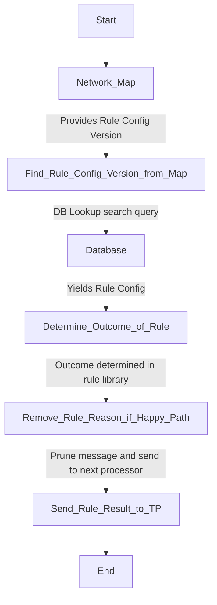

# Rule-executer

## Overview
Generic rule executer receives a message from the Event-Director and determines a result for a rule in a typology.

### Setting up:
You need to install a rule which has a function that meets this contract:
```js
async function handleTransaction(
  req: RuleRequest,
  determineOutcome: (
    value: number,
    ruleConfig: RuleConfig,
    ruleResult: RuleResult,
  ) => RuleResult,
  ruleRes: RuleResult,
  loggerService: LoggerService,
  ruleConfig: RuleConfig,
  databaseManager: DatabaseManagerInstance<ManagerConfig>,
): Promise<RuleResult> {}
```

This Rule-executer application will call this function to determine a rule's outcome (meaning the logic lives in a library). In this process, we allow the rule-executer to be generic.

## Inputs
```json
{
  "transaction": {
    "TxTp": "pacs.002.001.12",
    "FIToFIPmtSts": {
      "GrpHdr": {
        "MsgId": "33670de7086b4c8688e60478c714aadb",
        "CreDtTm": "2024-05-13T07:57:20.735Z"
      },
      "TxInfAndSts": {
        "OrgnlInstrId": "5ab4fc7355de4ef8a75b78b00a681ed2",
        "OrgnlEndToEndId": "41062f8f3b684680840d18e8b84adb81",
        "TxSts": "ACCC",
        "ChrgsInf": [
          {
            "Amt": {
              "Amt": 0,
              "Ccy": "USD"
            },
            "Agt": {
              "FinInstnId": {
                "ClrSysMmbId": {
                  "MmbId": "dfsp001"
                }
              }
            }
          },
          {
            "Amt": {
              "Amt": 0,
              "Ccy": "USD"
            },
            "Agt": {
              "FinInstnId": {
                "ClrSysMmbId": {
                  "MmbId": "dfsp001"
                }
              }
            }
          },
          {
            "Amt": {
              "Amt": 0,
              "Ccy": "USD"
            },
            "Agt": {
              "FinInstnId": {
                "ClrSysMmbId": {
                  "MmbId": "dfsp002"
                }
              }
            }
          }
        ],
        "AccptncDtTm": "2023-06-02T07:52:31.000Z",
        "InstgAgt": {
          "FinInstnId": {
            "ClrSysMmbId": {
              "MmbId": "dfsp001"
            }
          }
        },
        "InstdAgt": {
          "FinInstnId": {
            "ClrSysMmbId": {
              "MmbId": "dfsp002"
            }
          }
        }
      }
    }
  },
  "networkMap": {
    "active": true,
    "cfg": "1.0.0",
    "messages": [
      {
        "id": "004@1.0.0",
        "cfg": "1.0.0",
        "txTp": "pacs.002.001.12",
        "typologies": [
          {
            "id": "channel_i_typology_a@1.0.0",
            "cfg": "1.0.0",
            "rules": [
              {
                "id": "901@1.0.0",
                "cfg": "1.0.0"
              }
            ]
          }
        ]
      }
    ]
  },
  "DataCache": {
    "dbtrId": "dbtr_5f3e5de29b014400b841e607c4e01c00",
    "cdtrId": "cdtr_8f2b486b1fef40fa8b63cbc21c064930",
    "cdtrAcctId": "cdtrAcct_aa6e80b2211240869e99f7b9602c5232",
    "dbtrAcctId": "dbtrAcct_baeae78f58c74842800c3d3da3c3fdd6",
    "amt": {
      "amt": 1000,
      "ccy": "XTS"
    },
    "creDtTm": "2024-05-13T07:52:20.735Z"
  },
  "metaData": {
    "prcgTmDP": 0,
    "traceParent": "00-postman-33670de7086b4c8688e60478c714aadb-01",
    "prcgTmCRSP": 0
  }
}
```


## Internal Process Flow



## Outputs

```json
{
  "transaction": {
    "TxTp": "pacs.002.001.12",
    "FIToFIPmtSts": {
      "GrpHdr": {
        "MsgId": "7f0a384aced04031b264acab25fa68fd",
        "CreDtTm": "2024-05-13T07:59:09.746Z"
      },
      "TxInfAndSts": {
        "OrgnlInstrId": "5ab4fc7355de4ef8a75b78b00a681ed2",
        "OrgnlEndToEndId": "372c4f28bbb04e63b069251f9e77ea8d",
        "TxSts": "ACCC",
        "ChrgsInf": [
          {
            "Amt": {
              "Amt": 0,
              "Ccy": "USD"
            },
            "Agt": {
              "FinInstnId": {
                "ClrSysMmbId": {
                  "MmbId": "dfsp001"
                }
              }
            }
          },
          {
            "Amt": {
              "Amt": 0,
              "Ccy": "USD"
            },
            "Agt": {
              "FinInstnId": {
                "ClrSysMmbId": {
                  "MmbId": "dfsp001"
                }
              }
            }
          },
          {
            "Amt": {
              "Amt": 0,
              "Ccy": "USD"
            },
            "Agt": {
              "FinInstnId": {
                "ClrSysMmbId": {
                  "MmbId": "dfsp002"
                }
              }
            }
          }
        ],
        "AccptncDtTm": "2023-06-02T07:52:31.000Z",
        "InstgAgt": {
          "FinInstnId": {
            "ClrSysMmbId": {
              "MmbId": "dfsp001"
            }
          }
        },
        "InstdAgt": {
          "FinInstnId": {
            "ClrSysMmbId": {
              "MmbId": "dfsp002"
            }
          }
        }
      }
    }
  },
  "networkMap": {
    "active": true,
    "cfg": "1.0.0",
    "messages": [
      {
        "id": "004@1.0.0",
        "cfg": "1.0.0",
        "txTp": "pacs.002.001.12",
        "typologies": [
          {
            "id": "channel_i_typology_a@1.0.0",
            "cfg": "1.0.0",
            "rules": [
              {
                "id": "901@1.0.0",
                "cfg": "1.0.0"
              }
            ]
          }
        ]
      }
    ]
  },
  "DataCache": {
    "dbtrId": "dbtr_f213ed37b8864bedbf9891ddd0990d13",
    "cdtrId": "cdtr_a252ddf5582a475ebea30ddd6c91e097",
    "cdtrAcctId": "cdtrAcct_3cfa9be89336470e81f893db2df1f030",
    "dbtrAcctId": "dbtrAcct_1e3fb1e8e1634225888dcb40b5118d31",
    "amt": {
      "amt": 1000,
      "ccy": "XTS"
    },
    "creDtTm": "2024-05-13T07:54:09.746Z"
  },
  "metaData": {
    "prcgTmDP": 0,
    "traceParent": null,
    "prcgTmCRSP": 0
  },
  "ruleResult": {
    "id": "901@1.0.0",
    "cfg": "1.0.0",
    "subRuleRef": ".01",
    "prcgTm": 14403741
  }
}
```

## Environment Variables

| Name                            | Purpose                             | Example                                    |
|---------------------------------|-------------------------------------|--------------------------------------------|
| `FUNCTION_NAME`                 | Name of the function               | `rule-901`                                 |
| `RULE_NAME`                     | Name of the rule                   | `901`                                      |
| `RULE_VERSION`                  | Version of the rule                | `1.0.0`                                    |
| `NODE_ENV`                      | Node Runtime enviroment            | `dev`                                      |
| `APM_ACTIVE`                    | Flag for APM activation            | `false`                                    |
| `APM_SECRET_TOKEN`              | APM secret token                   | `some-apm-secret`                          |
| `APM_URL`                       | URL for APM                        | `http://localhost:9200`                    |
| `LOGSTASH_HOST`                 | Hostname for Logstash              | `my-release-logstash.frm-meshed`           |
| `LOGSTASH_PORT`                 | Port for Logstash                  | `http://localhost:9700`                    |
| `LOGSTASH_LEVEL`                | Log level for Logstash             | `info`                                     |
| `TRANSACTION_HISTORY_DATABASE`  | Database for transaction history   | `transactionHistory`                       |
| `TRANSACTION_HISTORY_DATABASE_USER` | User for transaction history database | `root`                              |
| `TRANSACTION_HISTORY_DATABASE_PASSWORD` | Password for transaction history database | `secret`                        |
| `TRANSACTION_HISTORY_DATABASE_URL` | URL for transaction history database | `http://localhost:8529`                                  |
| `CONFIG_DATABASE`               | Configuration database             | `Configuration`                            |
| `CONFIG_DATABASE_USER`          | User for configuration database    | `root`                                     |
| `CONFIG_DATABASE_URL`           | URL for configuration database     | `http://localhost:8529`                                       |
| `CONFIG_DATABASE_PASSWORD`      | Password for configuration database | `secret`                                      |
| `PSEUDONYMS_DATABASE`           | Database for pseudonyms            | `pseudonyms`                               |
| `PSEUDONYMS_DATABASE_USER`      | User for pseudonyms database       | `root`                                     |
| `PSEUDONYMS_DATABASE_URL`       | URL for pseudonyms database        | `http://localhost:8529`                                       |
| `PSEUDONYMS_DATABASE_PASSWORD`  | Password for pseudonyms database   | `secret`                                       |
| `CACHE_TTL`                     | Cache time-to-live in milliseconds | `400`                                          |
| `REDIS_DB`                      | Redis database (default is 0)      | `0`                                        |
| `REDIS_AUTH`                    | Authentication for Redis           | `secret`                              |
| `REDIS_SERVERS`                 | List of Redis servers in a json string | `[{"host":"127.0.0.1", "port":6379}, {"host":"127.0.0.1", "port":6380}]` |
| `REDIS_IS_CLUSTER`              | Flag for Redis clustering          | `false`                                    |
| `STARTUP_TYPE`                  | NATS feature [`nats` or `jetstream`]| `nats`                                     |
| `SERVER_URL`                    | [`NATS`] Server URL                | `localhost:4222`                             |
| `PRODUCER_STREAM`               | Producer stream                    | `RuleResponseRule-xxx`                     |
| `CONSUMER_STREAM`               | Consumer stream                    | `RuleRequest`                              |
| `STREAM_SUBJECT`                | Subject for stream                 | `RuleResponse`                             |
| `ACK_POLICY`                    | Acknowledgment policy              | `Explicit`                                 |
| `PRODUCER_STORAGE`              | Storage for producer               | `File`                                     |
| `PRODUCER_RETENTION_POLICY`     | Retention policy for producer      | `Workqueue`                                |

## publishing your rule as a library
Make sure you have a index.ts in the root of your rule that is exporting your `handleTransaction` method:
`export { handleTransaction }`

Ensure the "name" property in your package.json starts with your organization name, eg: `"name": "@frmscoe/rule-901",`

Ensure the Package.json has the following:
```json
  "publishConfig": {
    "@frmscoe:registry": "https://npm.pkg.github.com/"
  },
```

### Testing
To test a rule in the executer will be a two-step process. Firstly, pack your rule's code to a library on your machine, then install the Rule in the executor. 
1. From Rule-xxx run:
`npm run build` to make sure you've got the latest code built to publish
Followed by 
`npm pack` to create a tarball with the library artifacts. This will make a file with the extension `.tgz` containing the package version in the name
2. From Rule Executer run (`rule-xxx` needs to be the name as specified in the above rule's package.json). An example:
`npm i rule@file:../rule-901/frmscoe-rule-901-1.2.0.tgz`

Now you can run your rule engine and it will call the `handleTransaction` method from your desired Rule Processor. You'll be able to step into the method call while debugging.

## Deployment on Jenkins
The Jenkins job will have to call a packaged library. So the `rule` in the package.json will have to be installed as follows:
1. Firstly remove the current `rule` reference:
`npm uninstall rule`
2. Then install the expected release version of the `rule-processor` lib:
`npm i rule@npm:@frmscoe/rule-901@latest`

Furthermore, from Jenkins we'll also need to modify the rule-executer-deploy.yml file, to give the processor the correct name, as well as make sure it points to your library (note the above install / uninstall SED functions also in below script):

```
// Modify below lines to give the correct name for your Rule:
sh 'sed -i \'s/off-rule-executer/off-rule-901/g\' rule-executer-deploy.yml'
sh 'sed -i \'s/RULE_NAME="901"/RULE_NAME="901"/g\' Dockerfile'

withNPM(npmrcConfig: 'guid') {
  // Modify below line to give the correct library for your Rule (eg, change rule-901 to whatever your rule package is called):
  sh 'sed -i \'s/RUN npm install/COPY .npmrc .npmrc\\nRUN npm uninstall rule\\nRUN npm i rule@npm:@frmscoe\\/rule-901@latest\\nRUN npm install/g\' Dockerfile'
}
```

## Troubleshooting
- Application will not build when a rule is added as a dependency
  - Ensure `frms-coe-lib` is on the same version on the `rule-executor` and the `rule-lib`
