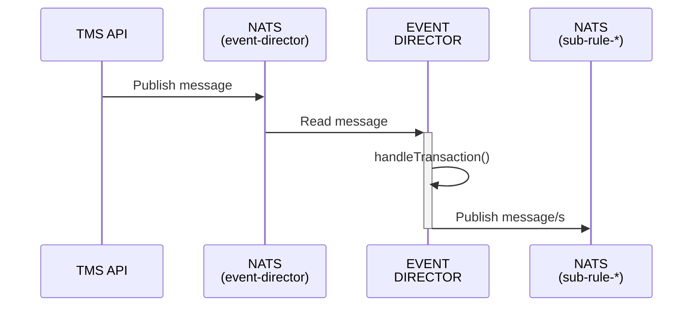
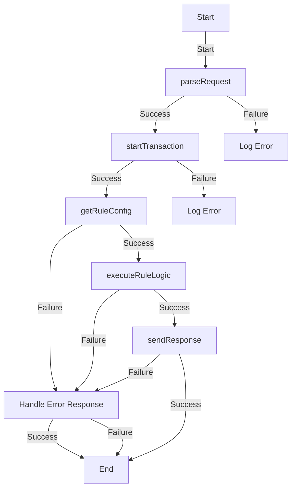

<!-- SPDX-License-Identifier: Apache-2.0 -->

# Rule-executer

## Overview
Generic rule executer receives a message from the Event-Director and determines a result for a rule in a typology.

### Services

- [ArangoDB](https://arangodb.com/): Database Management
- [NATS](https://nats.io): Message queue
- [Redis](https://redis.io): Redis

You also need NodeJS to be installed in your system. The current [LTS](https://nodejs.org/en) should be suitable. Please open an issue if the application fails to build on the current LTS version. Unix platforms, you should be able to find `nodejs` in your package manager's repositories.

#### Setting Up

```sh
git clone https://github.com/frmscoe/rule-executer
cd rule-executer
```
You then need to configure your environment: a [sample](.env.template) configuration file has been provided and you may adapt that to your environment. Copy it to `.env` and modify as needed:

```sh
cp .env.template .env
```
A [registry](https://github.com/frmscoe/docs) of environment variables is provided to provide more context for what each variable is used for.

#### Build and Start

```sh
npm i
npm run build
npm run start
```

## Inputs
A message received from CRSP:
```js
{
  metaData: { traceParent: "00-4bf92f3577b34da6a3ce929d0e0e4736-00f067aa0ba902b7-01" }, // https://www.w3.org/TR/trace-context/#examples-of-http-traceparent-headers
  transaction: { TxTp: "pacs.002.001.12", "FIToFIPmtSts": { /* Pacs002 */ } },
  networkMap: { /* Network Map */ },
  DataCache: { /* cached data relevant to the transaction */ }
};
```

## Internal Process Flow
### Sequence Diagram



### Activity Diagram


## Outputs

The output is the input with an added [RuleResult](https://github.com/frmscoe/frms-coe-lib/blob/dev/src/interfaces/rule/RuleResult.ts):

```js
{
  metaData: { traceParent: "00-4bf92f3577b34da6a3ce929d0e0e4736-00f067aa0ba902b7-01" }, // https://www.w3.org/TR/trace-context/#examples-of-http-traceparent-headers
  transaction: { TxTp: "pacs.002.001.12", "FIToFIPmtSts": { /* Pacs002 */ } },
  networkMap: { /* Network Map */ },
  DataCache: { /* cached data relevant to the transaction */ },
  ruleResult: { /* rule result */ }
};
```

## publishing your rule as a library
Make sure you have a index.ts in the root of your rule that is exporting your `handleTransaction` method:
`export { handleTransaction }`

Ensure the "name" property in your package.json starts with your organization name, eg: `"name": "@frmscoe/rule-901",`

Ensure the Package.json has the following:
```json
  "publishConfig": {
    "@frmscoe:registry": "https://npm.pkg.github.com/"
  },
```

### Testing
To test a rule in the executer will be a two-step process. Firstly, pack your rule's code to a library on your machine, then install the Rule in the executor. 
1. From Rule-xxx run:
`npm run build` to make sure you've got the latest code built to publish
Followed by 
`npm pack` to create a tarball with the library artifacts. This will make a file with the extension `.tgz` containing the package version in the name
2. From Rule Executer run (`rule-xxx` needs to be the name as specified in the above rule's package.json). An example:
`npm i rule@file:../rule-901/frmscoe-rule-901-1.2.0.tgz`

Now you can run your rule engine and it will call the `handleTransaction` method from your desired Rule Processor. You'll be able to step into the method call while debugging.

## Deployment on Jenkins
The Jenkins job will have to call a packaged library. So the `rule` in the package.json will have to be installed as follows:
1. Firstly remove the current `rule` reference:
`npm uninstall rule`
2. Then install the expected release version of the `rule-processor` lib:
`npm i rule@npm:@frmscoe/rule-901@latest`

Furthermore, from Jenkins we'll also need to modify the rule-executer-deploy.yml file, to give the processor the correct name, as well as make sure it points to your library (note the above install / uninstall SED functions also in below script):

```
// Modify below lines to give the correct name for your Rule:
sh 'sed -i \'s/off-rule-executer/off-rule-901/g\' rule-executer-deploy.yml'
sh 'sed -i \'s/RULE_NAME="901"/RULE_NAME="901"/g\' Dockerfile'

withNPM(npmrcConfig: 'guid') {
  // Modify below line to give the correct library for your Rule (eg, change rule-901 to whatever your rule package is called):
  sh 'sed -i \'s/RUN npm install/COPY .npmrc .npmrc\\nRUN npm uninstall rule\\nRUN npm i rule@npm:@frmscoe\\/rule-901@latest\\nRUN npm install/g\' Dockerfile'
}
```

## Troubleshooting
- Application will not build when a rule is added as a dependency
  - Ensure `frms-coe-lib` is on the same version on the `rule-executor` and the `rule-lib`
